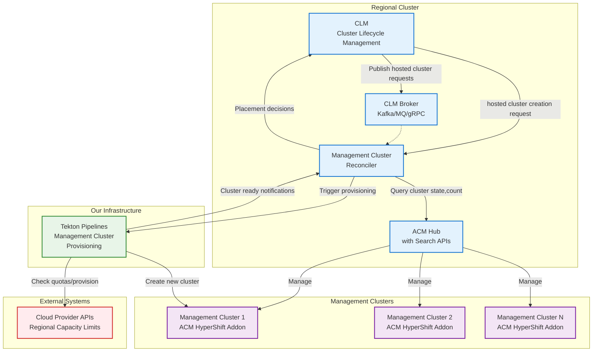

# Management Cluster Reconciler
## Design Document 
for [HYPERFLEET-153](https://issues.redhat.com/browse/HYPERFLEET-153)

> **Note**: Despite the name, this implements a predictive agent pattern, not a traditional Kubernetes reconciler pattern.

# Goal
The goal is to ensure reliable hosted cluster provisioning that meets our hosted cluster provisioning SLO while optimizing resource efficiency. Specifically, we need to:

1. **Not Impact SLO Performance:** Always have sufficient management cluster capacity available to provision hosted clusters within the SLO
2. **Optimize Resource Efficiency:** Minimize over-provisioning and waste by maintaining "just enough" capacity ahead of demand

The agent must balance these competing objectives - never compromising the SLO for cost savings, but also avoiding wasteful over-provisioning when demand patterns are predictable.

# Glossary
In Red Hat managed services space, we use the word management cluster interchangeably with ACM's managed cluster - but with one addition. The management clusters also host the hosted control plane for the hosted clusters. In other words, there is a ACM hub managing these management clusters. And in each of these management clusters, the ACM hypershift addon runs, and hosted control planes are created.

## Challenge
Each management cluster has a finite capacity for hosted control planes, determined by both resource constraints (CPU, memory) and infrastructure limitations (VPC limits, network capacity, etc.). When we approach this capacity limit, we need to create a new management cluster. Creating this management cluster takes time. Therefore we need to be ready in advance - just in time though to avoid wasting of resources.

## SLO Constraints
- **Hosted cluster provisioning SLO:** Minutes (hard requirement - cannot be broken)
- **Management cluster provisioning time:** 40-60 minutes (orders of magnitude longer)
- **Risk:** If no management cluster capacity is available, we cannot meet the SLO

### Core Problem
1. **Timing mismatch exists** (SLO << provisioning time)
2. **No capacity = guaranteed SLO miss**
3. **Need predictive provisioning to bridge the gap**

## Optimization Objectives
The agent operates with a clear hierarchy of objectives:
1. **Primary - SLO Guarantee:** Never miss the hosted cluster provisioning SLO (non-negotiable)
2. **Secondary - Cost Optimization:** Within SLO constraints, minimize over-provisioning and resource waste

Cost optimization is always **subordinate to** SLO performance - the agent will never compromise the hosted cluster provisioning SLO for cost savings, but will optimize efficiency when demand patterns allow predictable provisioning.

Different optimization strategies may be applied based on:
- Customer tier (premium customers prioritize performance)
- Time of day (business hours vs off-hours)
- Regional demand patterns
- Historical growth trends

## Methodology

### Core Problem: Timing Mismatch
The fundamental challenge is a timing mismatch between demand and supply:
- **Hosted cluster provisioning:** Minutes SLO (customer-facing)
- **Management cluster provisioning:** 40-60 minutes (as a ballpark; there are infrastructure constraint)

### Solution Approach: Predictive Feed-Forward Control
Rather than wait for capacity depletion and react (feedback control), we are **pro-active** by:

1. **Measuring the disturbance** (hosted cluster demand) before it affects the system
2. **Predicting future capacity needs** based on historical patterns and trends
3. **Triggering management cluster creation** proactively, 60-90 minutes ahead of predicted need


### Data-Driven Decision Making
The agent will make provisioning decisions based on:

1. **Current State:** Real-time capacity utilization across all management clusters
2. **Historical Patterns:** Seasonal trends, growth rates, and demand cycles
3. **Prediction Models:** Statistical forecasting of future demand within confidence intervals
4. **Context Awareness:** Customer tiers, regional patterns, and time-of-day variations

### Success Metrics
- **Primary:** Zero missed hosted cluster provisioning SLOs
- **Operational:** Prediction accuracy, provisioning success rate, reduced emergency interventions
- **Secondary:** Minimize unused management cluster capacity (cost optimization)

## Trade-offs

### What We Gain
- ✅ Proactive capacity management prevents SLO violations
- ✅ Predictive approach reduces emergency interventions

### What We Lose / What Gets Harder
- ❌ System complexity increases with prediction logic
- ❌ More failure modes to handle vs simple reactive scaling
- ⚠️ Risk of over-provisioning when predictions are wrong

## Implementation Progression

### Phase 0: Baby Step (Implement Now)
**Objective:** Basic capacity protection with zero historical data required

**The Flow:**
 - Placement Flow
    ```
    New hosted cluster placement call
        ↓
    1. Check current capacity 
        ↓
    2. Pick EXISTING management cluster for placement (return immediately)
    ```   
 - Background Flow:
    ```
    If threshold crossed → trigger NEW management cluster provisioning (async)
    ```

**Key Points:**
- **Placement = EXISTING clusters**: Return best available management cluster immediately
- **Provisioning = FUTURE capacity**: Async trigger for 40-60 minute provisioning cycle
- **No waiting**: Current request served immediately with existing capacity

**Implementation:**
- Fixed 90% utilization threshold
- Simple "highest available capacity" placement logic
- Event-driven on each hosted cluster request

**Example:**
```
Request arrives for us-east-1
Current state: mgmt-cluster-A (60%), mgmt-cluster-B (91%)

Immediate: "Place on mgmt-cluster-A" (60% utilization)
Async: "mgmt-cluster-B at 91% → trigger provisioning"

Result: Current request handled + future capacity protected
```

**Success Criteria:**
- Zero missed hosted cluster provisioning SLOs
- Successful automated provisioning pipeline
- Baseline telemetry collection established

### Phase 1: Data-Driven Tuning (After 2-8 Weeks Operation)
**Prerequisites:** Operational experience and performance data from Phase 0

**Phase 1a: Threshold Tuning** (Weeks 2-4)
- **Data Needed:** SLO violation patterns, utilization trends
- **Human Action:** Manually adjust threshold (90% → 85% → 87%)
- **Learning:** Optimal trigger point for your specific environment

**Phase 1b: Actuator Optimization** (Weeks 4-8)
- **Data Needed:** Demand patterns, cluster sizing effectiveness
- **Human Action:** Optimize cluster size, provisioning quantity, regional distribution
- **Learning:** Right-sized provisioning response per region/pattern

### Phase 2+: Advanced Features (After Months of Data)
**Prerequisites:** Long-term performance trends and deep system understanding

**Cannot be designed upfront** - depends entirely on Phase 1 learnings:

**Potential Evolution Paths:**
- **Adaptive Control**: If manual tuning shows clear patterns → automate threshold adjustment
- **Multi-Dimensional**: If resource constraints (not just count) become bottlenecks
- **Time Series Prediction**: If demand shows reliable seasonal/weekly patterns
- **Cost Optimization**: If over-provisioning becomes significant waste

**Key Principle:** **"You can't design Phase 2 without Phase 1 operational data"**

**Decision Timeline:**
- **Phase 0**: Implement immediately (no data needed)
- **Phase 1**: Plan after 2 weeks of Phase 0 operation
- **Phase 2+**: Design after 3+ months of production experience

## Dependencies

### Physical Deployment Context
The Management Cluster Reconciler runs on the **Regional Cluster** alongside other cluster management components, providing tight integration and efficient communication.



### Co-located Dependencies (Regional Cluster)
- **ACM Hub**: Cluster management, ManagedCluster CRs, and search APIs
- **ACM Search APIs**: Quantity of hosted clusters and state of management clusters
- **Tekton Pipelines**: Management cluster provisioning automation (owned by us, separate infrastructure)


### Configuration Dependencies
- **Regional capacity limits**: Provided via configuration from CLM (sourced from cloud provider quotas)


## Example: Monday Morning Spike Pattern

**Scenario:** Monday 9 AM with 8 hosted cluster requests (manageable spike)

**Phase 0 Response:**
```
Monday 8:59 AM: us-east-1 clusters at 75%, 80%, 85% utilization
Monday 9:00 AM: First 3 requests → placed on least loaded → 76%, 81%, 86%
Monday 9:01 AM: Next 2 requests → placed on least loaded → 77%, 82%, 86%
Monday 9:02 AM: Next 3 requests → placed on least loaded → 82%, 87%, 91%
Monday 9:02 AM: 91% > 90% threshold → trigger provisioning (async)
Monday 10:02 AM: New management cluster ready (60 minutes)
```

**Result:** All requests handled immediately with existing capacity.

**Note:** If significantly more requests arrived (10+), we'd hit ~95% utilization limits and some requests would need to wait. Whether this happens depends on actual demand patterns - we need operational data before engineering solutions for this scenario.


## Security

### Access Control
- **Service Account**: Dedicated Kubernetes ServiceAccount with minimal required permissions for Management Cluster Reconciler
- **API Authentication**: Secure authentication for CLM requests and external integrations
- **Network Policies**: Restrict network access to required services only


### Threat Mitigation
- **Identity Validation**: Do we implement SPIRE/SPIFFE ?
- **Rate Limiting**: Protect against DoS attacks on placement APIs


## Resiliency

### High Availability
- **Multi-Replica Deployment**: Run multiple agent instances with simple leader election.
- **Health Checks**: Comprehensive liveness and readiness probes for automatic recovery

### Fault Tolerance
- **Circuit Breakers**: Prevent cascade failures when external dependencies are unavailable
- **Retry Logic**: Exponential backoff for transient failures in lifecyle and data collection
- **Timeout Handling**: Configurable timeouts for all external service calls
- **Recovery from Pod Failures**: When the Reconciler initializes, it will always check with the Tekton pipeline to see the states of Management cluster lifecyle jobs. 

### Monitoring and Alerting
- **Operational Metrics**: Agent health, prediction accuracy
- **Performance Monitoring**: Response times, resource utilization, and capacity trends
- **Alert Generation**: Integration with existing incident management and paging systems

