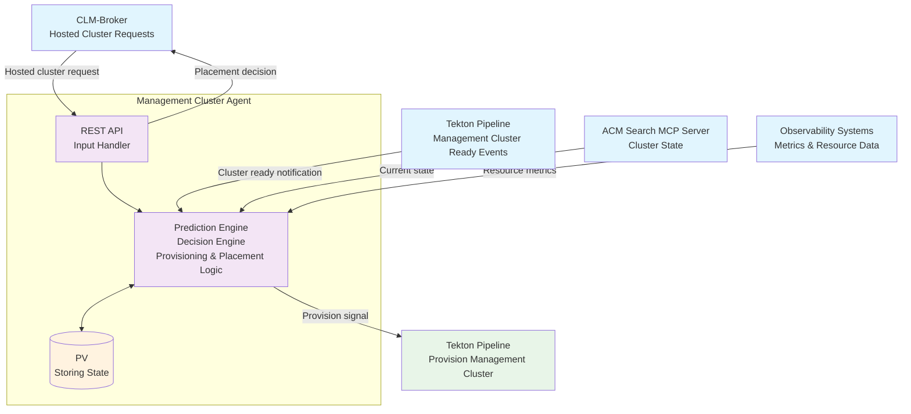

# Goal
The goal is to ensure reliable hosted cluster provisioning that meets our 10-minute SLO while optimizing resource efficiency. Specifically, we need to:

1. **Guarantee SLO Performance:** Always have sufficient management cluster capacity available to provision hosted clusters within 10 minutes
2. **Optimize Resource Efficiency:** Minimize over-provisioning and waste by maintaining "just enough" capacity ahead of demand

The agent must balance these competing objectives - never compromising the SLO for cost savings, but also avoiding wasteful over-provisioning when demand patterns are predictable.

# Glossary
In Red Hat managed services space, we use the word management cluster interchangeably with ACM's managed cluster - but with one addition. The management clusters also host the hosted control plane for the hosted clusters. In other words, there is a ACM hub managing these management clusters. And in each of these management clusters, the ACM hypershift addon runs, and hosted control planes are created.

## Challenge
Each management cluster has a finite capacity for hosted control planes, determined by both resource constraints (CPU, memory) and infrastructure limitations (VPC limits, network capacity, etc.). When we approach this capacity limit, we need to create a new management cluster. Creating this management cluster takes time. Therefore we need to be ready in advance - just in time though to avoid wasting of resources.

## SLO Constraints
- **Hosted cluster provisioning SLO:** 10 minutes (hard requirement - cannot be broken)
- **Management cluster provisioning time:** 40-60 minutes (the core challenge)
- **Risk:** If no management cluster capacity is available, we cannot meet the 10-minute SLO

## Optimization Objectives
The agent operates with a clear hierarchy of objectives:
1. **Primary - SLO Guarantee:** Never miss the 10-minute hosted cluster SLO (non-negotiable)
2. **Secondary - Cost Optimization:** Within SLO constraints, minimize over-provisioning and resource waste

Cost optimization is always **subordinate to** SLO performance - the agent will never compromise the 10-minute SLO for cost savings, but will optimize efficiency when demand patterns allow predictable provisioning.

Different optimization strategies may be applied based on:
- Customer tier (premium customers prioritize performance)
- Time of day (business hours vs off-hours)
- Regional demand patterns
- Historical growth trends

## Methodology

### Core Problem: Timing Mismatch
The fundamental challenge is a timing mismatch between demand and supply:
- **Hosted cluster provisioning:** 10-minute SLO (customer-facing)
- **Management cluster provisioning:** 40-60 minutes (as a ballpark; there are infrastructure constraint)

### Solution Approach: Predictive Feed-Forward Control
Rather than wait for capacity depletion and react (feedback control), we are **pro-active** by:

1. **Measuring the disturbance** (hosted cluster demand) before it affects the system
2. **Predicting future capacity needs** based on historical patterns and trends
3. **Triggering management cluster creation** proactively, 60-90 minutes ahead of predicted need

This is analogous to industrial process control where you compensate for known disturbances before they impact the process variable.

### Implementation Approach: Control Systems Commissioning

**Phase 1: Basic Control Loop Commissioning**
- Establish basic threshold-based control (e.g., provision when approaching capacity limit)
- Validate integration points and provide immediate SLO protection
- **Learn actual system characteristics** through operational experience
- Tune control parameters based on real performance data

**Phase 1 Sub-phases (Based on Operational Learning):**
- **Phase 1a: Threshold Tuning** - Adjust trigger points (90% → 85%) based on SLO performance
- **Phase 1b: Actuator Optimization** - Tune cluster sizing and provisioning parameters

**Future Control Strategies (Subject to Phase 1 Learning):**
- **Time Series Prediction**: If demand patterns prove sufficiently predictable
- **Multi-Dimensional Optimization**: If resource constraints become the primary limitation
- **Adaptive Control**: If system characteristics change significantly over time
- **Other approaches**: To be determined based on operational experience and system behavior

### Data-Driven Decision Making
The agent will make provisioning decisions based on:

1. **Current State:** Real-time capacity utilization across all management clusters
2. **Historical Patterns:** Seasonal trends, growth rates, and demand cycles
3. **Prediction Models:** Statistical forecasting of future demand within confidence intervals
4. **Context Awareness:** Customer tiers, regional patterns, and time-of-day variations

### Success Metrics
- **Primary:** Zero missed 10-minute hosted cluster SLOs
- **Operational:** Prediction accuracy, provisioning success rate, reduced emergency interventions
- **Secondary:** Minimize unused management cluster capacity (cost optimization)

## Concrete Example: Control Systems Commissioning Approach

**Scenario: "Monday Morning Spike"**
- **Observed pattern:** Every Monday at 9 AM, 15 new hosted clusters are typically requested (customer onboarding pattern)
- **Current state:** us-east-1 management cluster at 85% capacity (can handle ~3 more hosted clusters)
- **Timeline:** It's Sunday 11 PM (10 hours before expected spike)

### Phase 1: Initial Control Loop Commissioning
**Initial Settings:** Threshold = 90% capacity
```
Current: 85% capacity
Threshold: 90% capacity
Action: Wait until threshold is hit, then provision new cluster
```
**Timeline:**
- Sunday 11 PM: No action (below 90% threshold)
- Monday 9 AM: Spike begins, hits 90% threshold quickly
- Monday 9:05 AM: Provision request triggered
- Monday 10:05 AM: New cluster ready (60min later)
**Result:** ⚠️ Some Monday morning requests face delays

### Phase 1a: Threshold Tuning (Based on Monday's Performance)
**Learning:** 90% threshold caused SLO violations
**Adjustment:** Lower threshold to 85%
```
Next Week Scenario:
Sunday 11 PM: Now at 85% threshold - triggers provisioning immediately
Monday 12 AM: New cluster ready (60min later)
Monday 9 AM: Spike arrives, sufficient capacity available
```
**Result:** ✅ SLO met through parameter tuning

### Phase 1b: Actuator Optimization (After Several Weeks of Data)
**Learning:** Standard cluster size sometimes over/under provisions
**Adjustment:** Optimize cluster sizing based on actual demand patterns
```
Demand Analysis: Monday spikes average 12-18 clusters
Sizing Decision: Provision larger clusters (25 capacity) vs standard (15 capacity)
Trade-off: Less frequent provisioning vs potential over-provisioning
```

### Future Control Strategies (Subject to Operational Learning)
**If Pattern Recognition Proves Reliable:**
- **Time Series Prediction**: Proactive Sunday 11 PM provisioning based on Monday pattern detection
- **Multi-Dimensional**: Resource-aware sizing and placement optimization

**Key Control Systems Principle:**
Commission basic control first → Tune parameters based on real performance → Add sophistication only after understanding system behavior

## Implementation Strategy: Control Systems Commissioning

### Phase 1: Basic Control Loop Implementation
**Objective:** Commission fundamental capacity control with parameter tuning

**Initial Implementation:**
- Static threshold-based provisioning (start with 90% capacity trigger)
- Validate all integration points (CLM, Tekton, ACM, Observability)
- Establish monitoring and data collection foundation

**Phase 1a: Threshold Tuning**
- **Trigger:** Based on SLO performance analysis
- **Adjustments:** Modify threshold percentage (90% → 85% → 80% as needed)
- **Learning:** Understand system time constants and response characteristics

**Phase 1b: Actuator Optimization**
- **Trigger:** After collecting demand pattern data (4-8 weeks)
- **Adjustments:** Optimize cluster sizing, provisioning timing, regional distribution
- **Learning:** Understand capacity utilization patterns and cost trade-offs

**Success Criteria:**
- Zero missed 10-minute hosted cluster SLOs
- Successful automated provisioning pipeline
- Baseline telemetry and operational metrics established
- Tuned parameters based on real system behavior

**Configuration Evolution:**
```yaml
# Initial
agent:
  mode: "static"
  thresholdPercent: 90

# After tuning
agent:
  mode: "static"
  thresholdPercent: 85  # Tuned based on SLO performance
  clusterSize: "large"  # Tuned based on demand patterns
```

### Future Control Strategies (Subject to Phase 1 Learning)

**Time Series Prediction** (If demand proves predictable)
- Prerequisites: Proven patterns in Phase 1 data, reliable demand forecasting
- Approach: Proactive provisioning based on historical pattern recognition
- Risk: Requires sufficient data to be collected before we can see thru the noise

**Multi-Dimensional Optimization** (If resource constraints dominate)
- Prerequisites: Understanding of resource bottlenecks from Phase 1
- Approach: Resource-aware capacity decisions beyond simple counting
- Risk: Added complexity without proven simple control foundation

**Adaptive Control** (If system characteristics change)
- Prerequisites: Demonstrated need for dynamic parameter adjustment
- Approach: Self-tuning thresholds based on system performance
- Risk: Control instability without deep system understanding

## Risk Mitigation

### Failure Scenarios by Phase

#### Phase 1: Static Threshold Failures

**1. Configuration/State Loss**
```
Monday Spike Scenario:
Sunday 11 PM: Agent at 85% capacity, threshold=90%
Failure: PV corruption, lose threshold configuration
Fallback: Restart with conservative default (threshold=80%)
Result: Triggers provisioning immediately Sunday 11 PM
Outcome: Over-provisions but guarantees Monday spike capacity
```

#### Phase 2+: Prediction-Based Failures

**2. Prediction Error**
```
Monday Spike Scenario:
Sunday 11 PM: Predict 5 clusters Monday morning based on historical pattern
Monday 9 AM: Actually get 25 clusters (unexpected customer onboarding)
Fallback: Static threshold (90%) still triggers when capacity hit Monday 9:15 AM
Result: Some Monday requests face delays, but prevents total failure
```

**3. Historical Data Loss**
```
Monday Spike Scenario:
Sunday 10 PM: PV corruption, lose 3 months of prediction history
Sunday 11 PM: Cannot make reliable Monday morning predictions
Fallback: Revert to conservative static threshold (80% instead of 90%)
Result: Triggers immediate provisioning Sunday 11 PM, over-provisions but safe
```

#### All Phases: Infrastructure Failures

**4. Provisioning Pipeline Failure**
```
Monday Spike Scenario:
Sunday 11 PM: Agent correctly triggers new cluster provisioning
Reality: Tekton pipeline fails (cloud quota limits, network issues)
Fallback: Emergency capacity borrowing from us-west-2 region
Result: Monday spike handled with slightly higher latency
```

**5. Integration Failure**
```
Monday Spike Scenario:
Sunday 11 PM: Agent decides new cluster needed for Monday spike
Reality: ACM APIs down, cannot trigger provisioning automatically
Fallback: Manual override capabilities and alerting - page operations team immediately
Result: Manual cluster creation, agent resumes when integration restored
```

#### Key Principle
Each failure mode has a **safer fallback** - we'd rather over-provision than miss SLOs. The agent degrades gracefully through layers: Advanced features → Prediction → Static threshold → Manual intervention.

### Monitoring and Alerting
- Management cluster capacity warnings (< 20% available)
- SLO violation alerts (10-minute hosted cluster creation)

## High-Level System Design

The Management Cluster Agent is a stateful microservice that makes both provisioning and placement decisions based on real-time data and predictive analytics.

### System Architecture



### Data Flow Description

#### Input Sources
1. **CLM-Broker**: Real-time hosted cluster creation requests
2. **Tekton Pipeline**: Notifications when new management clusters are ready
3. **ACM Search MCP Server**: Current cluster capacity, state, and resource utilization
4. **Observability Systems**: Resource metrics (CPU, memory, network, disk)

#### Core Processing
- **Prediction Engine**: Combines demand forecasting, capacity prediction, and provisioning/placement decision logic
- **PV Storage**: Historical data and current state persistence

#### Output Actions
1. **Provisioning Signal**: Triggers Tekton pipeline to create new management clusters
2. **Placement Decision**: Returns target management cluster to CLM-Broker for hosted cluster placement

### Key Decision Points

**Provisioning Decision Flow:**
```
Hosted Cluster Request → Capacity Check → Prediction Analysis → Provision if Needed
```

**Placement Decision Flow:**
```
Available Clusters → Resource Analysis → Load Balancing → Return Best Target
```

### Agent Responsibilities
- **Capacity Management**: Ensure sufficient management cluster capacity
- **Intelligent Placement**: Route hosted clusters to optimal management clusters
- **Predictive Provisioning**: Proactively create capacity before demand spikes
- **State Management**: Maintain historical data and prediction accuracy

## Security

### Access Control
- **Service Account**: Dedicated Kubernetes ServiceAccount with minimal required permissions
- **RBAC**: Least-privilege access to ACM APIs, Tekton resources, and observability data
- **API Authentication**: Secure authentication for CLM-Broker requests and external integrations
- **Network Policies**: Restrict network access to required services only

### Data Protection
- **State Encryption**: Persistent volume encryption at rest for historical data and predictions
- **Transit Security**: TLS encryption for all API communications and data collection
- **Secrets Management**: Kubernetes secrets to be rotated regularly
- **Audit Logging**: Complete audit trail of provisioning decisions and capacity changes

### Threat Mitigation
- **Identity Validation**: Do we implement SPIRE/SPIFFE ?
- **Rate Limiting**: Protect against DoS attacks on provisioning and placement APIs
- **Privilege Isolation**: Agent runs with non-root user and minimal container privileges
- **Supply Chain**: Signed container images and dependency vulnerability scanning

## Resiliency

### High Availability
- **Multi-Replica Deployment**: Run multiple agent instances
- **Persistent Storage**: Replicated persistent volumes for state data across availability zones
- **Graceful Degradation**: Fallback to conservative thresholds when advanced features fail
- **Health Checks**: Comprehensive liveness and readiness probes for automatic recovery

### Fault Tolerance
- **Circuit Breakers**: Prevent cascade failures when external dependencies are unavailable
- **Retry Logic**: Exponential backoff for transient failures in provisioning and data collection
- **Timeout Handling**: Configurable timeouts for all external service calls
- **Dead Letter Queues**: Capture and analyze failed provisioning requests for debugging

### Disaster Recovery
- **State Backup**: Regular backups of historical data and configuration to object storage
- **Cross-Region Failover**: Ability to failover agent operations to backup regions
- **Configuration as Code**: All agent configuration stored in version control for rapid rebuilds
- **Recovery Testing**: Regular disaster recovery drills and failover validation

### Monitoring and Alerting
- **Operational Metrics**: Agent health, prediction accuracy, provisioning success rates
- **Performance Monitoring**: Response times, resource utilization, and capacity trends
- **Alert Generation**: Integration with existing incident management and paging systems

